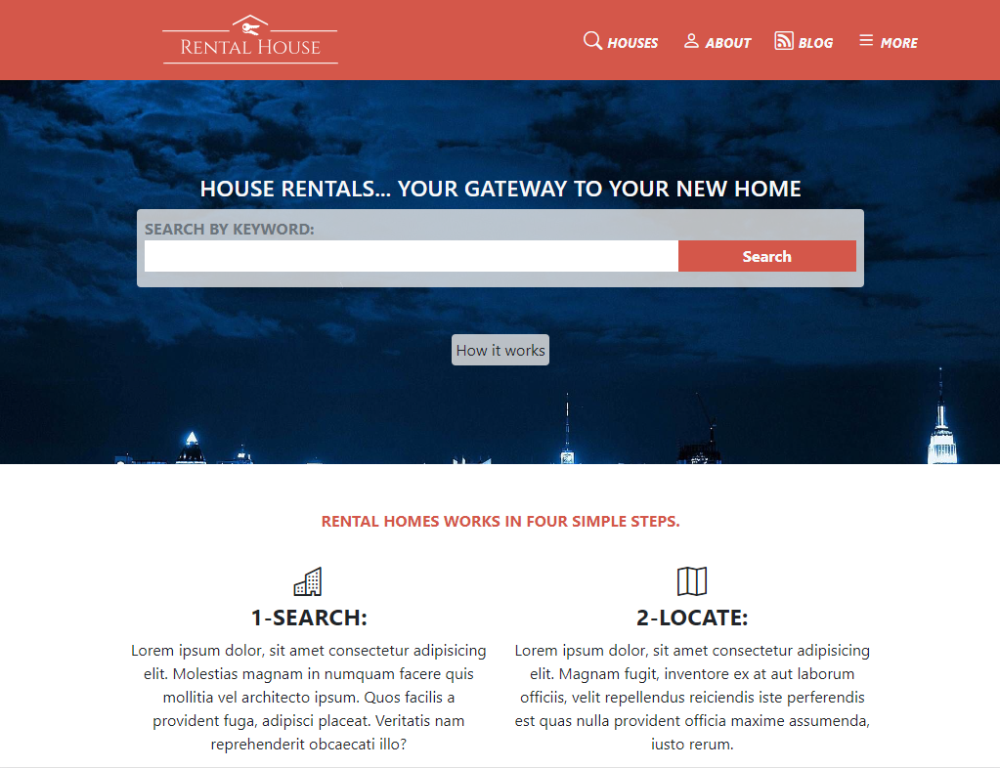

# Capstone Project: Building a house rental website.

> In this project, the main goal is to make a responsive house rental website following some layout and color patterns provided by Microverse in <a href="https://www.behance.net/gallery/25563385/PatashuleKE">this</a> site. The website consists of 3 pages, the main page, the search page with the search items, and the item details page that in this case is the house detail.

# Project Screenshot

> 

## Built With

- HTML5
- CSS3
- Git and GitHub
- VScode
- Bootstrap

## Live Demo

To see the live Demo of the project click [here](https://tiagorahal.github.io/rentalHomes-site/)

## Getting started

### Prerequisites

- Create an account on github

- Install gitbash or use git on the command line.

- Use an IDE of your preference such as VScode.

### Steps to follow

- Clone the repository to your local machine.

- Open the index.html file with the browser of your preference.

## Authors

👤 **Tiago Rahal Aires**

- GitHub: [@tiagorahal](https://github.com/tiagorahal)
- Twitter: [@RahalAires](https://twitter.com/RahalAires)
- LinkedIn: [Tiago Rahal Aires](https://linkedin.com/tiagorahal)

## 🤝 Contributing

Contributions, issues, and feature requests are welcome!

Feel free to check the [issues page](https://github.com/tiagorahal/rentalHomes-site/issues).

## Show your support

Give a ⭐️ if you like this project!

## Acknowledgments

- The inicial idea for this project was conceived by  [Mathew Njuguna](https://www.behance.net/mathewnjuguna)